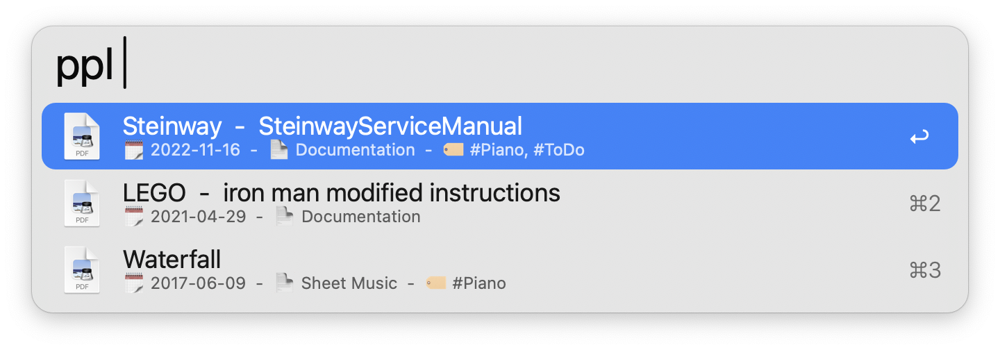
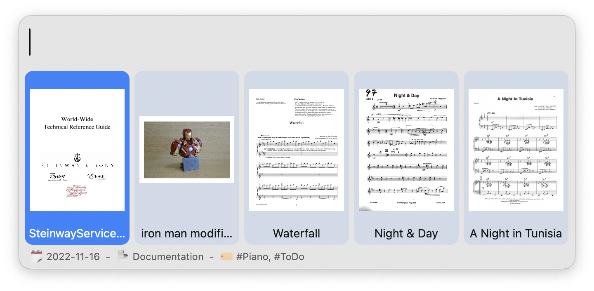
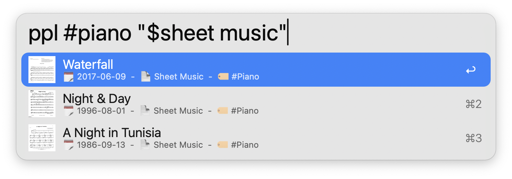
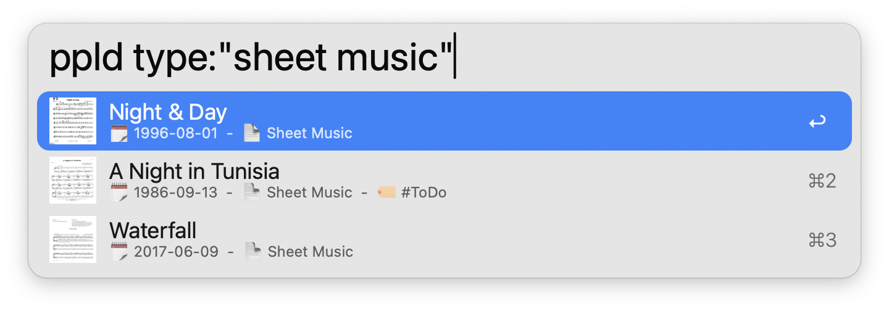
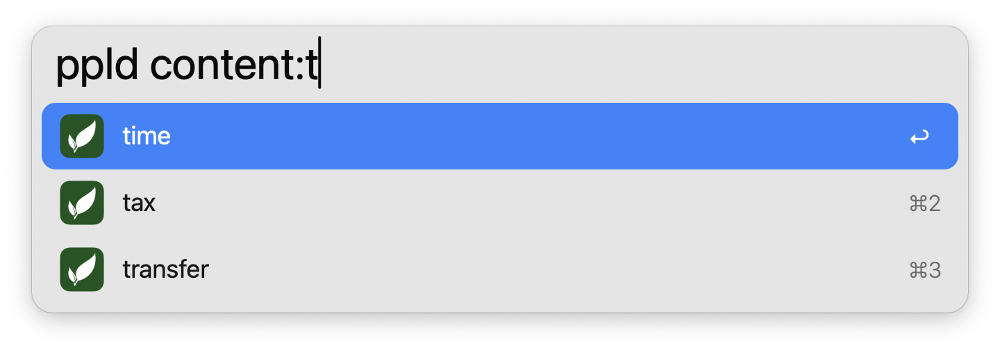
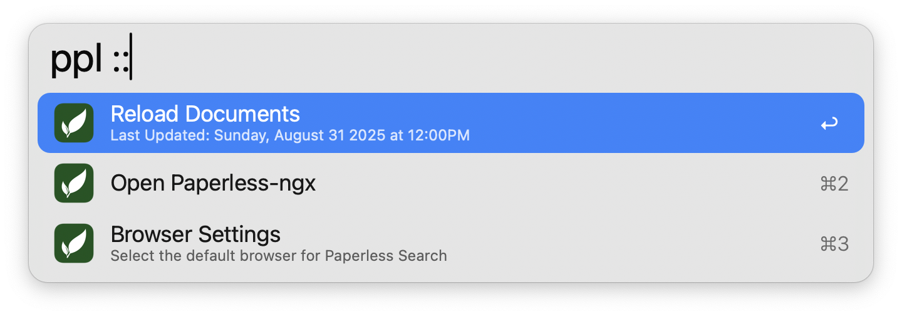

#  Paperless Search

Search & view Paperless-ngx documents in Alfred

## Setup

Set the Base URL and API Token of your [Paperless-ngx](https://docs.paperless-ngx.com/) installation in the [Workflow’s Configuration](https://www.alfredapp.com/help/workflows/user-configuration/). You can find the API Token from the "My Profile" link in the user dropdown found in the web UI.

**Note**: This workflow requires [jq](https://jqlang.github.io/jq/) to function, which comes preinstalled on macOS 15 Sequoia and later.

## Usage

Search your [Paperless-ngx](https://docs.paperless-ngx.com/) documents via the `ppl` keyword. Documents can be presented in a list or a grid.

Type to refine your search. Documents are always searchable by Title and Creation Date, while filtering by Correspondent, Tag, and Document Type is configurable from the [Workflow’s Configuration](https://www.alfredapp.com/help/workflows/user-configuration/).

* <kbd>↩</kbd> Open document in browser.
* <kbd>⌘</kbd><kbd>↩</kbd> Open document in Alfred.
* <kbd>⌥</kbd><kbd>↩</kbd> View document details in Paperless web UI.
* <kbd>⌃</kbd><kbd>⌘</kbd><kbd>↩</kbd> Switch between list and grid views.

Append `d` to the configured [Keyword](https://www.alfredapp.com/help/workflows/inputs/keyword) to use Paperless's own search mechanism instead of Alfred's. While slower, this allows for more [granular search functions](https://docs.paperless-ngx.com/usage/#document-searches) by querying the Paperless API directly.

* <kbd>↩</kbd> Open document in browser.
* <kbd>⌘</kbd><kbd>↩</kbd> Open document in Alfred.
* <kbd>⌥</kbd><kbd>↩</kbd> View document details in Paperless web UI.
* <kbd>⇧</kbd><kbd>⌥</kbd><kbd>↩</kbd> View search in Paperless web UI.

Paperless can provide autocomplete suggestions if no documents match your query. Select an autocompletion by pressing <kbd>⇥</kbd> or <kbd>↩</kbd>.

Append `::` to the configured [Keyword](https://www.alfredapp.com/help/workflows/inputs/keyword) to access other actions, including manually reloading the document cache.

Configure the [Hotkeys](https://www.alfredapp.com/help/workflows/triggers/hotkey/) as shortcuts for each document search mechanism.

Use the [Universal Action](https://www.alfredapp.com/help/features/universal-actions/) to upload [supported files](https://docs.paperless-ngx.com/faq/#what-file-types-does-paperless-ngx-support) to Paperless from Alfred's [Clipboard History](https://www.alfredapp.com/help/features/clipboard/) or selected files.

